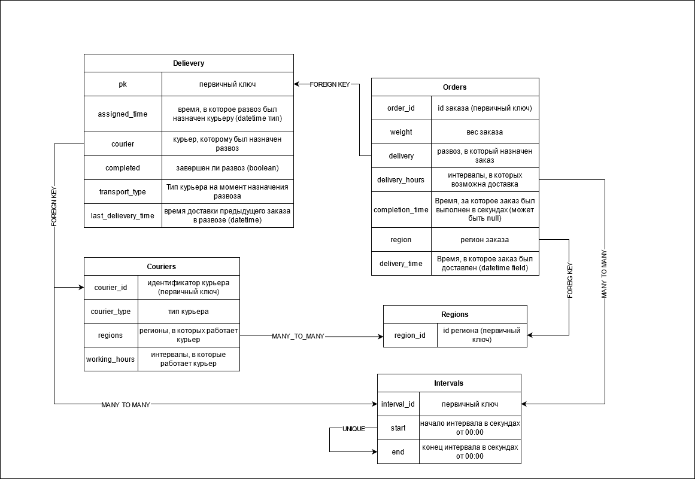

# Candyapi

Реализация тестового задания от школы бэкенд-разработки Яндекса, реализующее REST API 
для управления курьерами и заказами службы доставки

## Требования

1. Docker

2. docker-compose

## Инструкции по деплою

1. Клонируем репозиторий

```
git clone https://github.com/IntAlgambra/candyapi.git
```

2. Переходим в папку проекта и создаем файл с переменными окружения .candyapi.env

```
cd candyapi
touch .candyapi.env
```

3. Прописываем в .candyapi.env необходимые переменные окружения

```
DJANGO_SECRET_KEY=секретный ключ приложения Джанго
POSTGRES_USER=имя пользователя в БД Postgres
POSTGRES_PASSWORD=пароль пользователя в БД Postgres
DJANGO_HOST=хост или ip на котором развернуто приложение
```

4. Запускаем приложение  и производим миграции БД

```
docker-compose up -d --build
docker-compose run --rm backend python manage.py migrate
```

## Обновление приложения

1. Подтягиваем новую версию приложения из удаленного репозитория

```
git pull
```

2. Пересобираем контейнеры и запускаем миграции БД

```
docker-compose up -d --build
docker-compose run --rm backend python manage.py migrate
```

## Тестирование

Запускаем тесты в отдельном контейнере, имеющем доступ к контейнеру с БД

```
docker-compose run --rm backend python manage.py test
```

## Развертывание в режиме для разработки

В данном режиме сервис запускается с помощью встроенного веб-сервера django,
обновляется при изменении исходного кода и выводит информацию о запросах и
ошибках непосредственно в консоль.

```
docker-compose -f docker-compose.dev.yml up --build
```

## Схема базы данных приложения



## Используемые библиотеки

1.  ### Django

    Основной фреймворк проекта, выбран из-за наличия опыта работы с Django и удобства работы с БД 
    через Django ORM

2.  ### django-extensions

    Набор инстрементов, облегчающих управление django-проектами. Используется для удобного запуска скриптов в контексте django

3.  ### pydantic

    Используется для валидации и структурирования входных данных

4.  ### python-dateutil

    Используется для парсинга времени

5. ### gunicorn

    wsgi сервер для деплоя приложения

## Примечания

1.  ### Неоднозначное поведение при назначении развозов.

    На данный момент в функционале программы возможен следующий случай - курьеру назначаются заказы и сразу же закрываются с указанием в complete_time будущего времени. В результате, после выполнения развоза и нового назначения, время в assign_time нового развоза может быть меньшим, чем время завершения заказов из предыдущего. Данный баг предусмотрен и оставлен сознательно, чтобы системы тестирования имели возможность использовать любое время в complete_time. В боевой системе было бы запрещено передавать в complete_time время большее, чем текущее по серверу (django.utils.timezone.now()).


